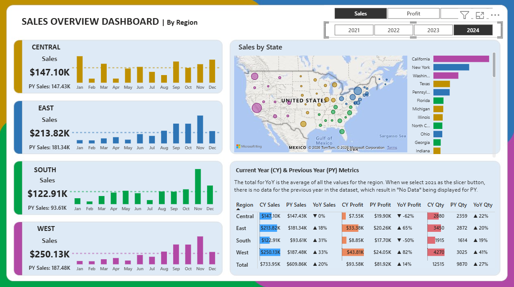

# 📊 Sales Overview Dashboard | Power BI


A dynamic, multi-region **Sales Overview Dashboard** built in Power BI that tracks Current Year vs Previous Year performance, year-over-year trends, and dynamic KPIs across four U.S. regions — Central, East, South, and West — with interactive slicers and map visuals.

---

## 🖼️ Dashboard Preview

> 📥 Download and open `Sales_Overview_Analysi.pbix` in **Power BI Desktop** to explore the full interactive report.
>


---

## 📌 Overview

This dashboard provides a comprehensive view of sales performance broken down by region, with current year (CY) vs previous year (PY) comparisons. It is designed for business stakeholders who need a quick, high-level summary of regional sales health and trends.

---

## ✨ Features

- **Dynamic Metric Selector** — Slicer to switch between different KPIs (Sales, Profit, Quantity)
- **Year Slicer** — Filter the entire report by year
- **4 Regional Panels** — Dedicated sections for Central, East, South, and West regions, each showing:
  - Dynamic Title Card (updates based on slicer selection)
  - Total Sales (CY) KPI Card
  - PY KPI Sales Card
  - Monthly Clustered Column Chart (Month vs Total Sales)
- **U.S. Map Visual** — Sales distribution by State/Province and Region
- **Horizontal Bar Chart** — Regional sales comparison by State/Province
- **Pivot Table** — Detailed CY vs PY breakdown including:
  - CY Sales / PY Sales / YoY Sales
  - CY Profit / PY Profit / YoY Profit
  - CY Qty / PY Qty / YoY Qty

---

## 📐 Report Structure

| Element | Detail |
|---|---|
| Pages | 1 (Sales Overview) |
| Page Size | 1280 × 720 px |
| Visuals | 33 total |
| Data Source | Sales Data table |
| Created From | Power BI Cloud (2026.02 release) |

---

## 📊 Key Measures Used

| Measure | Description |
|---|---|
| `Total Sales` | Current year total sales |
| `PY KPI Sales` | Previous year KPI for sales comparison |
| `Dynamic Title` | Context-sensitive title based on slicer selection |
| `Summary Title` | Dynamic title for the overall summary card |
| `CY Sales` | Current year sales (used in pivot table) |
| `PY Sales` | Previous year sales |
| `YoY Sales` | Year-over-year sales change |
| `CY Profit` | Current year profit |
| `PY Profit` | Previous year profit |
| `YoY Profit` | Year-over-year profit change |
| `CY Qty` | Current year quantity |
| `PY Qty` | Previous year quantity |
| `YoY Qty` | Year-over-year quantity change |

---

## 📂 Repository Structure

```
Sales_Overview_Dashboard/
│
├── Sales_Overview_Analysi.pbix   # Main Power BI report file
├── README.md                     # Project documentation
├── .gitignore                    # Git ignore rules
└── CHANGELOG.md                  # Version history
```

---

## 🚀 Getting Started

### Prerequisites

- [Power BI Desktop](https://powerbi.microsoft.com/desktop/) (free) — version 2.151+ recommended

### Steps

1. Clone or download this repository
2. Open `Sales_Overview_Analysi.pbix` in Power BI Desktop
3. If prompted, update the data source connection to point to your local data
4. Refresh the data and explore the dashboard

---

## ⚠️ Notes

- When **2021 is selected** in the Year slicer, PY metrics will show **"No Data"** — this is expected behavior since no prior-year data exists for that year in the dataset.
- The **YoY totals** in the pivot table represent the **average** of all regional YoY values, not a sum.
- The dashboard was built using the **CY26SU02** Power BI theme.

---

## 🛠️ Built With

- [Microsoft Power BI Desktop](https://powerbi.microsoft.com/)
- DAX (Data Analysis Expressions) for calculated measures
- Power Query (M Language) for data transformation

---

## 📄 License

This project is open for portfolio and educational purposes. Feel free to use it as a reference or template — a ⭐ star is appreciated if you find it helpful!
